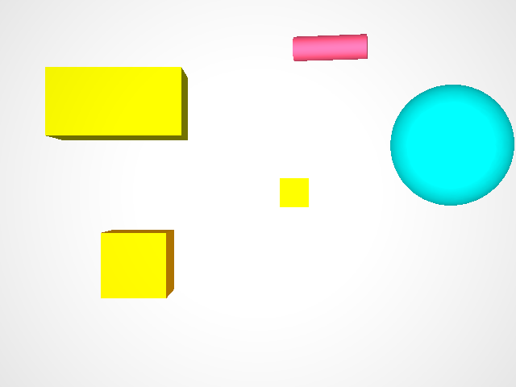
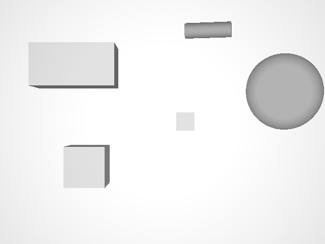
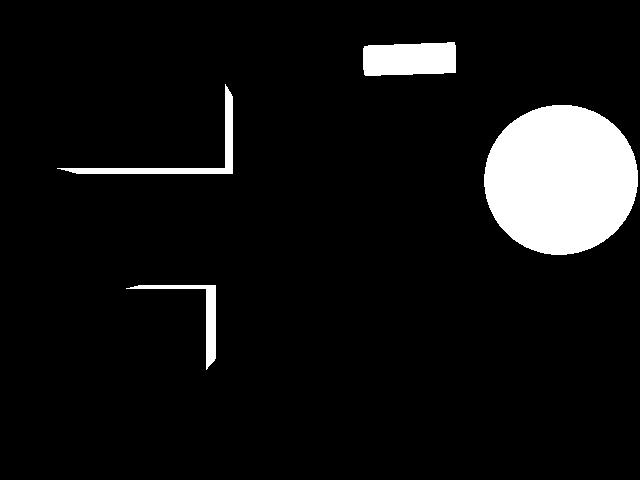
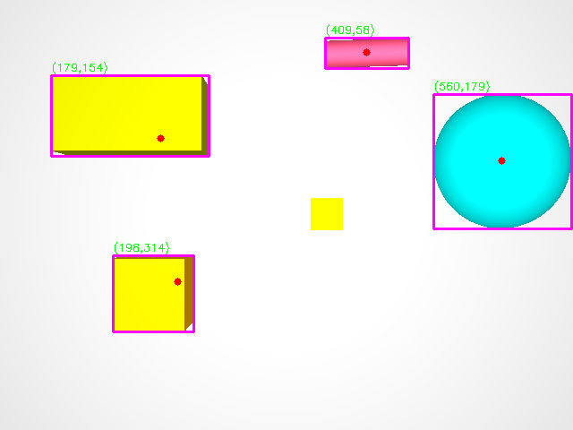
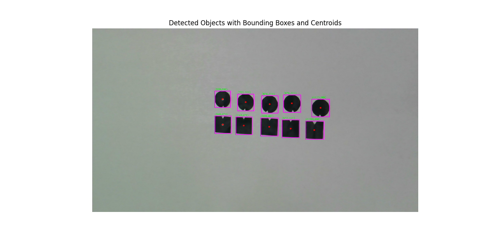
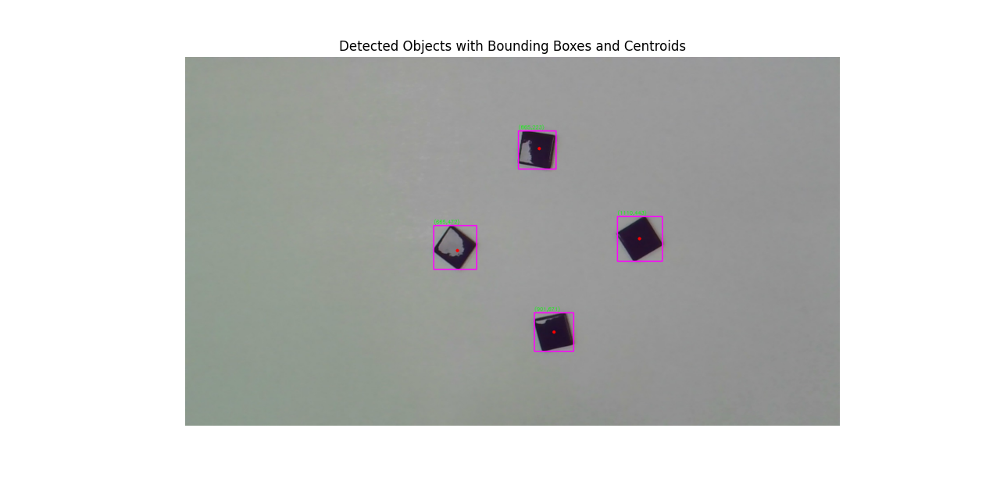
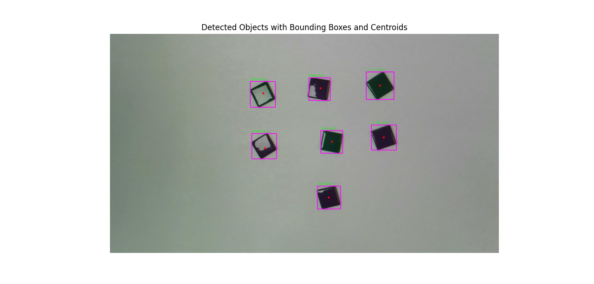
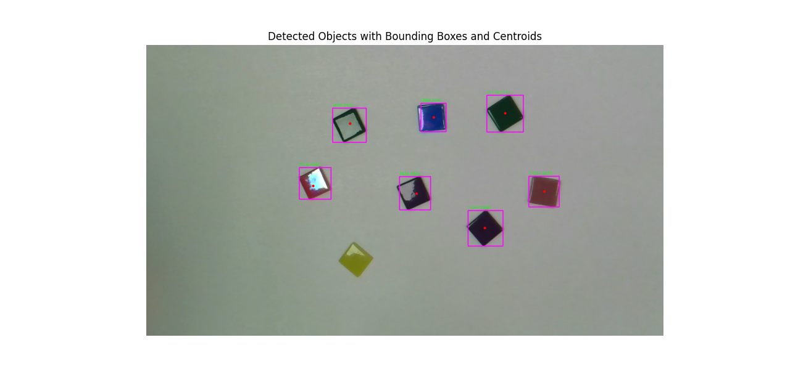

# Machine Vision – Segmentation Lab

**Git Hub Link:**
 https://github.com/enamulhqdk/Machine_vision_segmentation04  

**Group members:**  
Ariba Mayeesha , Choton Enamul , Ifty Fardin , Nizam Sabiha , Taqi Muhammad  

**Course:** Machine vision  
**Date:** 06/02/2026  

## Part A: Simulated Image (RoboDK)

### 1. Introduction

The goal of this lab is to implement a basic machine vision segmentation pipeline. In Part A, a simulated image from RoboDK is used to test the segmentation steps in a controlled environment.

### 2. Part A – Simulated Image

#### 2.1 Image Acquisition

The simulated image was obtained from a RoboDK environment using a virtual camera. The scene contains several geometric objects with different shapes and colors placed on a uniform background. This setup provides a clean and noise-free image.

#### 2.2 Segmentation Pipeline

The segmentation process consists of several sequential steps. First, the image was loaded using OpenCV and converted to grayscale to enable intensity-based processing. A grayscale histogram was then analyzed to verify that the image contained a clear separation between background and objects. Based on this observation, Otsu’s thresholding method was applied to generate a binary image where objects are separated from the background.

After thresholding, connected component analysis was used to detect individual objects in the binary image. For each detected object, features such as bounding boxes and centroid coordinates were extracted and visualized on the original image.

#### 2.3 Results

The segmentation pipeline successfully detected multiple objects in the simulated image. The resulting binary image shows the detected objects in white and the background in black. Bounding boxes and centroid positions were drawn on the original image to visualize the detected object locations.

Some objects with brightness values close to the background were not fully detected. In these cases, only partial edges were visible in the binary image. This behavior is expected due to the limited contrast between certain objects and the background.

### 3. Conclusion

In this part of the lab, a complete segmentation pipeline was implemented and tested using a simulated RoboDK image. The results demonstrate how grayscale conversion, thresholding, and connected component analysis can be combined to detect object locations. This pipeline serves as a foundation for processing real images.

### 4. Figures

- Original simulated image  

- Grayscale image  

- Binary image after Otsu thresholding  

- image with bounding boxes and centroids  

## 5.Discussion

### Which thresholding method gave the most stable results?

Otsu’s thresholding method gave the most stable results for the simulated image. The grayscale histogram showed a clear separation between the background and the objects, which made this method suitable. Otsu’s method automatically selected an appropriate threshold value and produced a consistent binary image without the need for manual tuning. Compared to manual thresholding, it was more reliable for this image.

### Did preprocessing or morphological operations help?

For the simulated image, preprocessing and morphological operations did not significantly improve the results. The image was clean, noise-free, and had uniform lighting, which made thresholding sufficient on its own. Because of this, additional filtering or morphological operations were not necessary in Part A. The segmentation quality was already acceptable without these steps.

### What errors or limitations still remain in the segmentation results?

Some limitations were observed in the segmentation results. Objects with brightness values close to the background were not fully detected, and in some cases only their edges were visible in the binary image. This occurred because the grayscale intensity of these objects was similar to the background, which made threshold-based segmentation less effective. As a result, not all objects were completely segmented.

### How could the lighting or camera setup be improved?

The segmentation results could be improved by increasing the contrast between the objects and the background. More uniform lighting and reduced reflections would help separate objects more clearly in grayscale images. Additionally, adjusting the camera position or exposure settings could improve object visibility and lead to more reliable segmentation.

## Part B – Real Images

In Part B, the same segmentation pipeline was applied to four real images. These images contained paper markers or mosaic tiles placed on a table.

### Processing Steps

The exact same code and processing pipeline from Part A was used. I used Morphological operations and area-based filtering to real images which remove noise.

### Real Images

- Real image 1  

- Real image 2  

- Real image 3  

- Real image 4  

### Results and Observations

The pipeline successfully detected most objects across all real images. In one case, objects was not detected. For example, in the fourth real image, one bright-colored tile was not segmented correctly due to its similarity in intensity to the background after grayscale conversion. It shows global thresholding method doesnot work well on different situations.

---

### Q1: Which thresholding method gave the most stable results across your real images?

For the real images in Part B, Otsu’s global thresholding method gave the most stable overall results. I used the same thresholding approach for all four real images without manually changing any threshold values. Before applying thresholding, I checked the grayscale histogram to understand how pixel intensity values were distributed. In images with darker tiles and good contrast, the histogram showed a clearer separation between background and objects, and Otsu thresholding separated them well. However, when the lighting was uneven or when objects had a similar brightness to the background, the histogram values overlapped, and some objects were not detected correctly. From this, I learned that Otsu thresholding is convenient and automatic, but its performance strongly depends on lighting conditions and contrast in real images.

### Q2: Did preprocessing (filtering and/or contrast enhancement) and morphology help improve segmentation?

Yes, preprocessing and morphological operations clearly improved the segmentation results for the real images. After converting the images to grayscale, I observed that small intensity variations and background texture caused many false detections during thresholding. To reduce this effect, Gaussian blurring was applied to smooth the grayscale image before thresholding. This helped reduce noise in the histogram and made thresholding more stable. Morphological opening removed small noise blobs, while morphological closing improved the shape of the detected objects by filling small gaps. I learned that preprocessing and morphology is an important for preparing real images for reliable segmentation.

### Q3: What kinds of errors still remain (false positives, missed objects, shape distortions)?

Some errors were still present even after applying the full segmentation pipeline.objects with very low contrast compared to the background were not detected, especially bright colored tiles. When observing the binary images, I noticed that these objects did not form clear connected regions because their grayscale values were too close to the background. In addition, morphological operations sometimes slightly changed object boundaries, which affected the size and shape of the bounding boxes. Uneven lighting also caused parts of the background to appear as small blobs, although most of these were removed using area-based filtering by checking the connected component area values with an area smaller than 800 pixels. Threshold-based segmentation has limitations in real environments.

### Q4: How would you change the lighting or camera setup in the real lab to make segmentation easier?

To make segmentation easier in a real lab setup, lighting conditions should be more controlled and uniform. From the experiments, I noticed that uneven lighting directly affected grayscale intensity values and histogram distribution, which made thresholding less reliable. Using diffuse lighting from multiple directions would reduce shadows and reflections on the objects. Choosing a background with clearly different grayscale values compared to the objects would also improve threshold separation. In addition, keeping the camera position fixed and using consistent exposure settings would reduce variations between images and make the segmentation pipeline more reliable.
